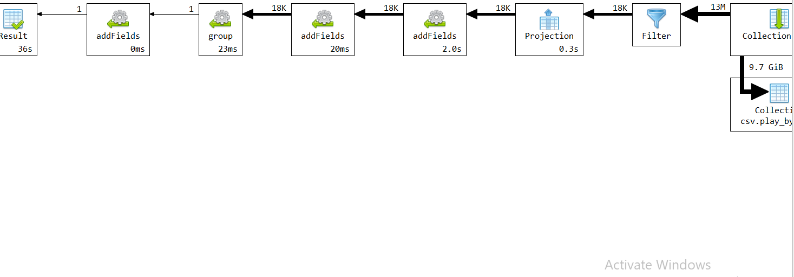

# Upit 4 - Statistika Nikole Jokica, procenat uspesnosti za slobodna bacanja i sut za tri poena

## Izvršavanje upita

```
db.getCollection("play_by_play").aggregate(
        [
       {
            "$match": {
                "player1_name": "Nikola Jokic"
            }
        },
        {
            "$addFields": {
                home_free_throw: {
                    "$cond": [{
                        "$regexMatch": {
                            input: "$homedescription",
                            regex: /Free Throw/,
                            options: "i"
                        }
                    }, 1, 0]
                },
                away_free_throw: {
                    "$cond": [{
                        "$regexMatch": {
                            input: "$visitordescription",
                            regex: /Free Throw/,
                            options: "i"
                        }
                    }, 1, 0]
                },
                home_miss_free_throw: {
                    "$cond": [{
                    "$and": [
                        {
                            "$regexMatch": {
                                input: "$visitordescription",
                                regex: /MISS/,
                                options: "i"
                            }
                        },
                        {
                            "$regexMatch": {
                                input: "$visitordescription",
                                regex: /Free Throw/,
                                options: "i"
                            }
                        }
                    ]
                }, 1, 0]
                },
                away_miss_free_throw: {
                    "$cond": [{
                    "$and": [
                        {
                            "$regexMatch": {
                                input: "$visitordescription",
                                regex: /MISS/,
                                options: "i"
                            }
                        },
                        {
                            "$regexMatch": {
                                input: "$visitordescription",
                                regex: /Free Throw/,
                                options: "i"
                            }
                        }
                    ]
                }, 1, 0]
                },
            }
        },
        {
            "$addFields": {
                home_3pt: {
                    "$cond": [{
                        "$regexMatch": {
                            input: "$homedescription",
                            regex: /3PT Jump Shot/,
                            options: "i"
                        }
                    }, 1, 0]
                },
                away_3pt: {
                    "$cond": [{
                        "$regexMatch": {
                            input: "$visitordescription",
                            regex: /3PT Jump Shot/,
                            options: "i"
                        }
                    }, 1, 0]
                },
                home_miss_3pt: {
                    "$cond": [{
                    "$and": [
                        {
                            "$regexMatch": {
                                input: "$visitordescription",
                                regex: /MISS /,
                                options: "i"
                            }
                        },
                        {
                            "$regexMatch": {
                                input: "$visitordescription",
                                regex: /3PT Jump Shot/,
                                options: "i"
                            }
                        }
                    ]
                }, 1, 0]
                },
                away_miss_3pt: {
                    "$cond": [{
                    "$and": [
                        {
                            "$regexMatch": {
                                input: "$visitordescription",
                                regex: /MISS/,
                                options: "i"
                            }
                        },
                        {
                            "$regexMatch": {
                                input: "$visitordescription",
                                regex: /3PT Jump Shot/,
                                options: "i"
                            }
                        }
                    ]
                }, 1, 0]
                },
            }
        },
        {
            "$group": {
                _id: "$player1_name",
                total_free_throw: {
                    "$sum": {
                        "$add": ["$home_free_throw", "$away_free_throw"]
                    }
                },
                total_miss_free_throw: {
                       "$sum": {
                        "$add": ["$home_miss_free_throw", "$away_miss_free_throw"]
                    }
                },
                total_3pt :{
                    "$sum": {
                        "$add": ["$home_3pt", "$away_3pt"]
                }
               },
               total_3pt_miss :{
                    "$sum": {
                        "$add": ["$home_miss_3pt", "$away_miss_3pt"]
                }
               }
            }
        },
        {
            "$addFields" : {
                "free_throw_%" : {"$multiply": [{"$divide" : [{"$subtract" : ["$total_free_throw","$total_miss_free_throw"]},"$total_free_throw"]},100]},
                 "three_points_%" : {"$multiply": [{"$divide" : [{"$subtract" : ["$total_3pt","$total_3pt_miss"]},"$total_3pt"]},100]}  
            }
        }
    ],
    {
        "allowDiskUse" :true
    }
);

```

## Statistika upita 



## Zaključak 

**Ukupno vreme trajanja upita:** 36 sekundi

**Broj ulaznih dokumenata:** 13 miliona

Prilikom analiziranja explain naredbe, uočava se da je najviše vremena utrošeno na operaciju grupisanja kada je potrebno sracunati ukupan broj suteva za 3 poena i slobodna bacanja.

