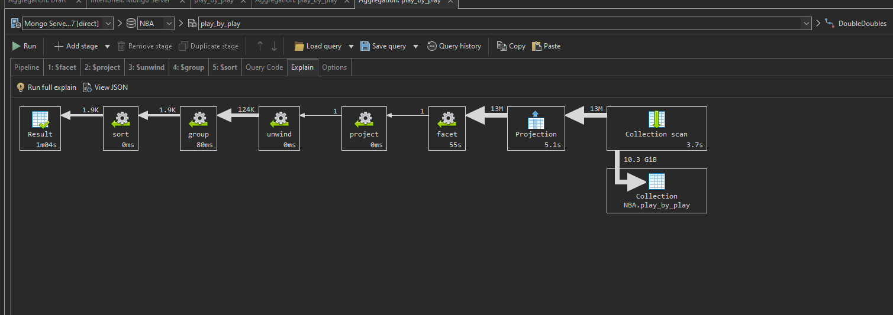

# Upit 5 - Igraci sa najvise double-double ucinaka

## Izvršavanje upita

```
db.getCollection("play_by_play").aggregate(
    [
        {
            "$facet" : {
                "assists" : [
                    {
                        "$match" : {
                            "eventmsgtype" : NumberInt(1)
                        }
                    },
                    {
                        "$match" : {
                            "$or" : [
                                {
                                    "homedescription" : /10 AST/i
                                },
                                {
                                    "awaydescription" : /10 AST/i
                                }
                            ]
                        }
                    },
                    {
                        "$group" : {
                            "_id" : {
                                "game_id" : "$game_id",
                                "player" : "$player2_name"
                            }
                        }
                    }
                ],
                "points" : [
                    {
                        "$match" : {
                            "eventmsgtype" : NumberInt(1)
                        }
                    },
                    {
                        "$match" : {
                            "$or" : [
                                {
                                    "homedescription" : /(10 PTS)|(11 PTS)|(12 PTS)/i
                                },
                                {
                                    "awaydescription" : /(10 PTS)|(11 PTS)|(12 PTS)/i
                                }
                            ]
                        }
                    },
                    {
                        "$group" : {
                            "_id" : {
                                "game_id" : "$game_id",
                                "player" : "$player1_name"
                            }
                        }
                    }
                ]
            }
        }, 
        {
            "$project" : {
                "newRoot" : {
                    "$concatArrays" : [
                        "$assists",
                        "$points"
                    ]
                }
            }
        }, 
        {
            "$unwind" : {
                "path" : "$newRoot"
            }
        }, 
        {
            "$group" : {
                "_id" : {
                    "player" : "$newRoot._id.player",
                    "game" : "$newRoot_id.game_id"
                },
                "cnt" : {
                    "$sum" : NumberInt(1)
                }
            }
        }, 
        {
            "$sort" : {
                "cnt" : NumberInt(-1)
            }
        }
    ], 
    {
        "allowDiskUse" : false
    }
);
```

## Statistika upita 


## Zaključak 

**Ukupno vreme trajanja upita:** 64 sekunde

**Broj ulaznih dokumenata:** 13 miliona

Prilikom analiziranja explain naredbe, uočava se da je najviše vremena utrošeno na operaciju facet koja treba da grupise dve kolekcije od iste tabele preko zajednickih vrednosti polja


