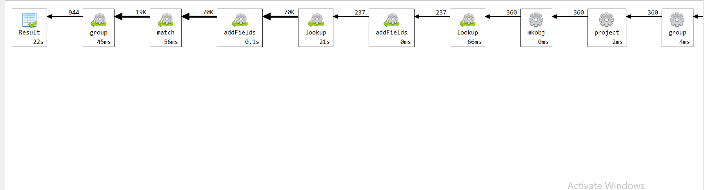

# Upit 1 - Koliko pobeda po sezoni ostvari prvih 5 pikova na draftu u u prve 3 sezone nakon drafta

## Izvršavanje upita

```
db.getCollection("Draft").aggregate(
    [
       
        {
            "$group" : {
                "_id" : {
                    "pick" : "$numberPickOverall",
                    "name" : "$namePlayer",
                    "team_name" : "$nameTeam",
                    "year" : "$yearDraft",
                    "abbr" : "$slugTeam"
                }
            }
        }, 
        {
            "$lookup" : {
                "from" : "team",
                "localField" : "_id.abbr",
                "foreignField" : "abbreviation",
                "as" : "team_info"
            }
        },
         
        {
            "$unwind" : {
                "path" : "$team_info"
            }
        }, 
        {
            "$addFields" : {
                "start_date" : {
                    "$dateFromParts" : {
                        "year" : "$_id.year",
                        "month" : NumberInt(1),
                        "day" : NumberInt(1)
                    }
                },
                "end_date" : {
                    "$dateFromParts" : {
                        "year" : {
                            "$add" : [
                                "$_id.year",
                                NumberInt(3)
                            ]
                        },
                        "month" : NumberInt(12),
                        "day" : NumberInt(12)
                    }
                }
            }
        }, 
        {
            "$lookup" : {
                "from" : "game",
                "let" : {
                    "team_id" : "$team_info.id",
                    "start_date" : "$start_date",
                    "end_date" : "$end_date"
                },
                "pipeline" : [
                    {
                        "$addFields" : {
                            "year" : {
                                "$toInt" : {
                                    "$substr" : [
                                        "$game_date",
                                        NumberInt(0),
                                        NumberInt(4)
                                    ]
                                }
                            },
                            "month" : {
                                "$toInt" : {
                                    "$substr" : [
                                        "$game_date",
                                        NumberInt(5),
                                        NumberInt(2)
                                    ]
                                }
                            },
                            "day" : {
                                "$toInt" : {
                                    "$substr" : [
                                        "$game_date",
                                        NumberInt(8),
                                        NumberInt(2)
                                    ]
                                }
                            }
                        }
                    },
                    {
                        "$addFields" : {
                            "game_date_obj" : {
                                "$dateFromParts" : {
                                    "year" : "$year",
                                    "month" : "$month",
                                    "day" : "$day"
                                }
                            }
                        }
                    },
                    {
                        "$match" : {
                            "$expr" : {
                                "$and" : [
                                    {
                                        "$or" : [
                                            {
                                                "$eq" : [
                                                    "$team_id_home",
                                                    "$$team_id"
                                                ]
                                            },
                                            {
                                                "$eq" : [
                                                    "$team_id_away",
                                                    "$$team_id"
                                                ]
                                            }
                                        ]
                                    },
                                    {
                                        "$gte" : [
                                            "$game_date_obj",
                                            "$$start_date"
                                        ]
                                    },
                                    {
                                        "$lt" : [
                                            "$game_date_obj",
                                            "$$end_date"
                                        ]
                                    }
                                ]
                            }
                        }
                    },
                    {
                        "$project" : {
                            "year" : NumberInt(0),
                            "month" : NumberInt(0),
                            "day" : NumberInt(0),
                            "game_date_obj" : NumberInt(0)
                        }
                    }
                ],
                "as" : "games"
            }
        },
        {
            "$match" : {
                "_id.pick" : {"$in" : [1,2,3,4,5]} 
            }
        },
         {
            "$unwind" : "$games"    
        },
        {
        "$addFields": {
            victory: {
                "$cond": [
                    { "$eq": ["$games.team_abbreviation_home", "$_id.abbr"] }, 
                    { "$cond": [{ "$eq": ["$games.wl_home", "W"] }, "W", "L"] },
                    {
                        "cond": [
                            { "$eq": ["$games.team_abbreviation_away", "$_id.abbr"] }, 
                            { "$cond": [{ "$eq": ["$games.wl_away", "W"] }, "W", "L"] },
                            "N/A"
                        ]
                    }
                ]
            }
        }
    },
    {
        "$match" : {"victory" : "W"}
    },
    
    {
        "$group": {
            "_id" : {
                    "pick" : "$_id.pick",
                    "name" : "$_id.name",
                    "team_name" : "$_id.team",
                    "year" : {
                                "$toInt" : {
                                    "$substr" : [
                                        "$games.game_date",
                                        NumberInt(0),
                                        NumberInt(4)
                                    ]
                                }
                            },
                    "abbr" : "$slugTeam"
                },
            totalWins: { "$sum": 1 }
        }
    } 
     
 
        
    ], 
    {
        "allowDiskUse" : true
    }
);

```

## Statistika upita 



## Zaključak 

**Ukupno vreme trajanja upita:** 22 sekunde

**Broj ulaznih dokumenata:** 7.9 hiljada

Prilikom analiziranja explain naredbe, uočava se da je najviše vremena utrošeno na operaciju lookup kako bi se za svaki tim pronasle sve utakmice u naredne 3 sezone.

