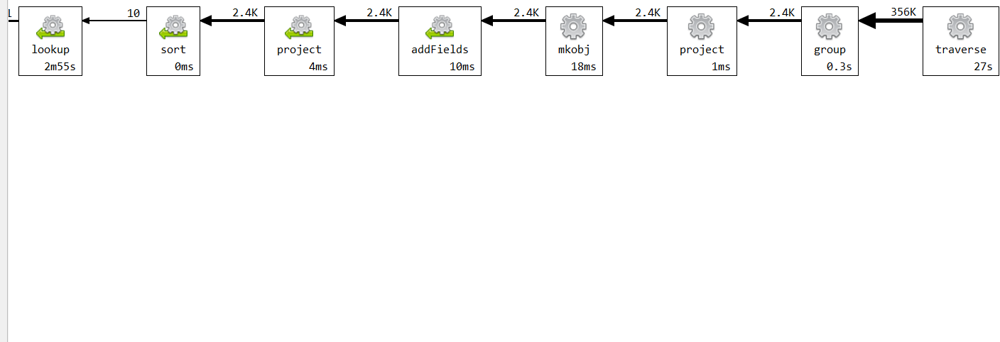
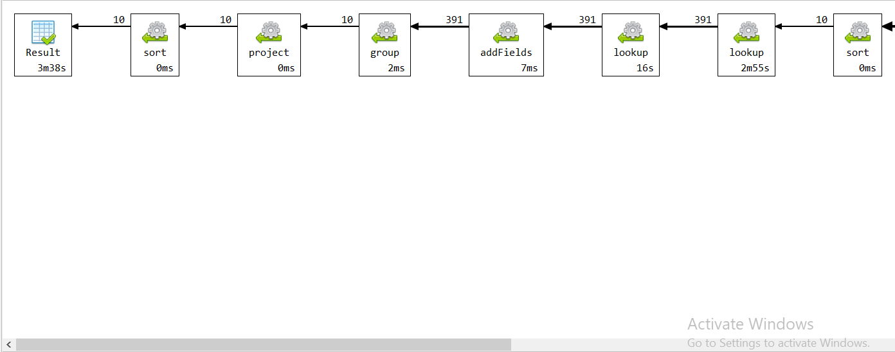

# Upit 2 - Top 10 igraca po prosecnom broju faulova po utakmici i od kad do kad im je trajala karijera

## Izvršavanje upita

```
db.getCollection("play_by_play").aggregate(
    [
           { "$match": { eventmsgtype: 6, eventmsgactiontype: 2 } },
           
         
          { "$group": {
              _id: { player: "$player1_name", game_id: "$game_id" },
              count: { "$sum": 1 }
          }},
         
          { "$group": {
              _id: "$_id.player",
              total_count: { "$sum": "$count" },
              unique_games: { "$addToSet": "$_id.game_id" }
          }},
         
          { "$addFields": { number_of_games: { "$size": "$unique_games" } }},

          { "$project": {
              _id: 0,
              player: "$_id",
              avg_per_game: { "$divide": ["$total_count", "$number_of_games"] }
          }},
          { "$sort": { avg_per_game: -1 } },
          { "$limit" : 10},
          {
              "$lookup" : {
                from : "play_by_play",
                localField : "player",
                foreignField : "player1_name",
                as : "year_p"
              }
          },
          {
              "$unwind" : "$year_p"
          },
          {
              "$lookup" :{
                  from : "game",
                  localField : "year_p.game_id",
                  foreignField : "game_id",
                  as : "data"
              }
          }
          ,
          {
              "$addFields" :{
                  "year":  {"$substr" :[ {"$toString" : {"$arrayElemAt": ["$data.game_date", 0]}},0,4]}
              }
          },
                  { "$group": {
              _id: { player: "$player", avg: "$avg_per_game" },
              min_year: { "$min": "$year" },
              max_year: { "$max": "$year" }
          }},
          // Project fields to show in the result
          { "$project": {
              _id: 0,
              player: "$_id.player",
              avg_fouls: "$_id.avg",
              min_year: 1,
              max_year: 1
          }},
          {
              "$sort": { "avg_fouls": -1 }
          }
                              
    
    ],
    {
        "allowDiskUse" : true    
    }
);
```

## Statistika upita 




## Zaključak 

**Ukupno vreme trajanja upita:** 226 sekunde

**Broj ulaznih dokumenata:** 356 hiljada

Prilikom analiziranja explain naredbe, uočava se da je najviše vremena utrošeno na operaciu lookup koja zeli da pronadje sve akcije u kojima se pronasao igrac


