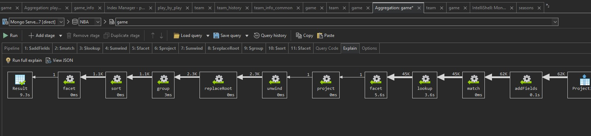

# Upit 5 - Analizirati kako se menjao broj šutnutih i postignutih trojki po sezoni od 1980. godine do danas, i odrediti procente sutnutih i postignuti trojki po ekipi po sezoni

## Izvršavanje upita

```
db.getCollection("game").aggregate(
    [
        {
            "$addFields" : {
                "year" : {
                    "$toInt" : {
                        "$substr" : [
                            "$game_date",
                            NumberInt(0),
                            NumberInt(4)
                        ]
                    }
                }
            }
        }, 
        {
            "$match" : {
                "year" : {
                    "$gte" : NumberInt(1981)
                }
            }
        }, 
        {
            "$lookup" : {
                "from" : "seasons",
                "localField" : "season_id",
                "foreignField" : "season_id",
                "as" : "season"
            }
        }, 
        {
            "$unwind" : {
                "path" : "$season"
            }
        }, 
        {
            "$facet" : {
                "home" : [
                    {
                        "$lookup" : {
                            "from" : "team",
                            "localField" : "team_id_home",
                            "foreignField" : "id",
                            "as" : "team"
                        }
                    },
                    {
                        "$unwind" : "$team"
                    },
                    {
                        "$group" : {
                            "_id" : {
                                "season" : "$season.season_year",
                                "team" : "$team.full_name"
                            },
                            "averageAttemptedThrees" : {
                                "$avg" : "$fg3a_home"
                            },
                            "averageMadeThrees" : {
                                "$avg" : "$fg3m_home"
                            },
                            "totalAttemptedThrees" : {
                                "$sum" : "$fg3a_home"
                            },
                            "totalMadeThrees" : {
                                "$sum" : "$fg3m_home"
                            },
                            "totalGames" : {
                                "$sum" : NumberInt(1)
                            }
                        }
                    }
                ],
                "away" : [
                    {
                        "$lookup" : {
                            "from" : "team",
                            "localField" : "team_id_away",
                            "foreignField" : "id",
                            "as" : "team"
                        }
                    },
                    {
                        "$unwind" : "$team"
                    },
                    {
                        "$group" : {
                            "_id" : {
                                "season" : "$season.season_year",
                                "team" : "$team.full_name"
                            },
                            "averageAttemptedThrees" : {
                                "$avg" : "$fg3a_away"
                            },
                            "averageMadeThrees" : {
                                "$avg" : "$fg3m_away"
                            },
                            "totalAttemptedThrees" : {
                                "$sum" : "$fg3a_away"
                            },
                            "totalMadeThrees" : {
                                "$sum" : "$fg3m_away"
                            },
                            "totalGames" : {
                                "$sum" : NumberInt(1)
                            }
                        }
                    }
                ]
            }
        }, 
        {
            "$project" : {
                "combined" : {
                    "$concatArrays" : [
                        "$home",
                        "$away"
                    ]
                }
            }
        }, 
        {
            "$unwind" : {
                "path" : "$combined"
            }
        }, 
        {
            "$replaceRoot" : {
                "newRoot" : "$combined"
            }
        }, 
        {
            "$group" : {
                "_id" : "$_id",
                "averageAttemptedThrees" : {
                    "$avg" : "$averageAttemptedThrees"
                },
                "averageMadeThrees" : {
                    "$avg" : "$averageMadeThrees"
                },
                "totalAttemptedThrees" : {
                    "$sum" : "$totalAttemptedThrees"
                },
                "totalMadeThrees" : {
                    "$sum" : "$totalMadeThrees"
                },
                "totalGames" : {
                    "$sum" : "$totalGames"
                }
            }
        }, 
        {
            "$sort" : {
                "_id.season" : NumberInt(-1),
                "_id.team" : NumberInt(1)
            }
        }, 
        {
            "$facet" : {
                "teamAverages" : [
                    {
                        "$project" : {
                            "_id" : NumberInt(0),
                            "season" : "$_id.season",
                            "team" : "$_id.team",
                            "averageAttemptedThrees" : {
                                "$round" : [
                                    "$averageAttemptedThrees",
                                    NumberInt(2)
                                ]
                            },
                            "averageMadeThrees" : {
                                "$round" : [
                                    "$averageMadeThrees",
                                    NumberInt(2)
                                ]
                            },
                            "totalGames" : NumberInt(1)
                        }
                    }
                ],
                "overallAverages" : [
                    {
                        "$group" : {
                            "_id" : "$_id.season",
                            "averageAttemptedThreesOverall" : {
                                "$avg" : "$totalAverageAttemptedThrees"
                            },
                            "averageMadeThreesOverall" : {
                                "$avg" : "$totalAverageMadeThrees"
                            }
                        }
                    },
                    {
                        "$sort" : {
                            "_id" : NumberInt(1)
                        }
                    }
                ]
            }
        }
    ], 
    {
        "allowDiskUse" : false
    }
);
```

## Statistika upita 



## Zaključak 

**Ukupno vreme trajanja upita:** 10 sekundi

**Broj ulaznih dokumenata:** 65 hiljada 


