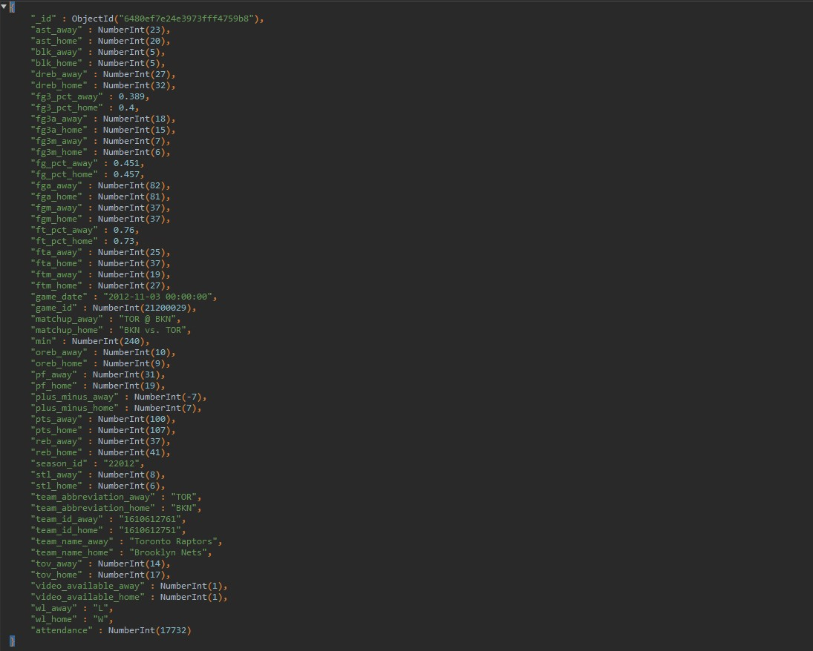
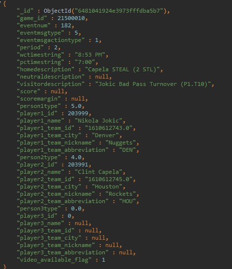
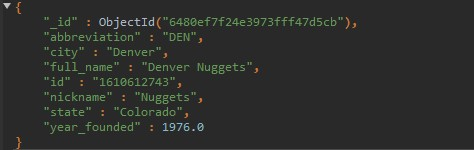
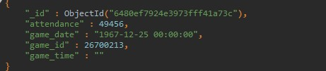
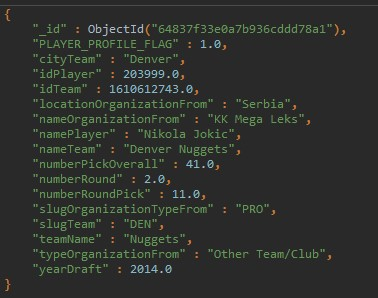
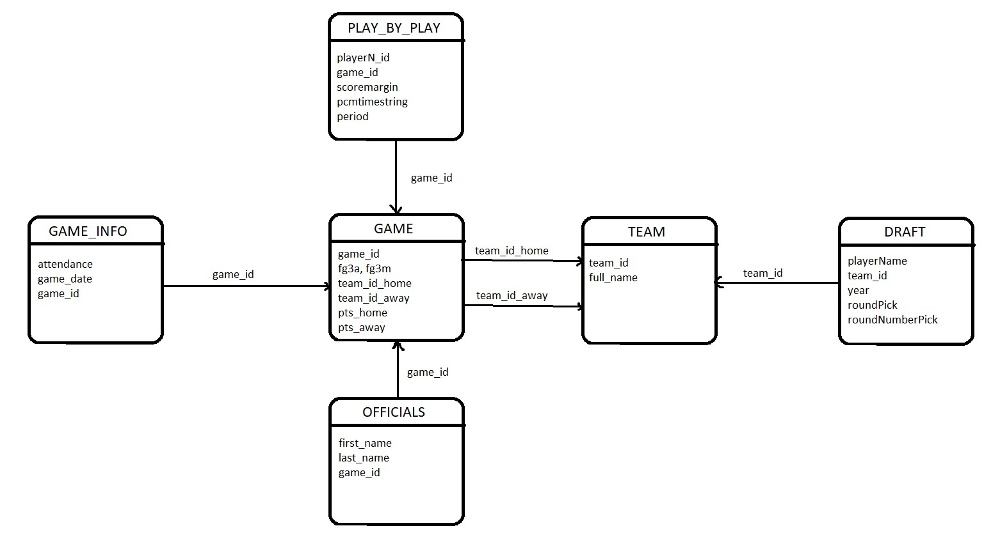

# Inicijalna Shema Baze Podataka

## Kolekcije 

U ovoj sekciji biće pojašnjene kolekcije, atributi entiteta, kao i međusobne veze između različitih kolekcija

### Kolekcija _**GAME**_

Atributi (Polja) koja su od značaja za naše upite su: 
* **fg3a** - broj pokušaja za 3 poena na utakmici 
* **fg3m** - broj postignutih trojki na utakmici 
* **game_date** - datum i vreme održavanja utakmice 
* **team_id** - polje koje referencira kolekciju _**team**_
* **game_id** - identifikaciona oznaka utakmice 
* **pts_home, pts_away** - broj postignutih poena domaćina odnosno gosta

### Kolekcija _**PLAY_BY_PLAY**_

Atributi (Polja) koja su od značaja za naše upite su: 
* **playerN_id**: identifikaciona oznaka igrača koji učestvuje u akciji
* **homedescription, awaydescription:** opis akcije koja se dogodila 
* **period:** četvrtina u kojoj se akcija dogodila 
* **scoremargin:** koš razlika u posmatranom trenutku 
* **pctimestring:** vreme do kraja četvrtine 
* **game_id:** polje koje referencira kolekciju **_game_**

### Kolekcija _**OFFICIALS**_

Atributi (Polja) koja su od značaja za naše upite su: 
* **first_name, last_name:** ime i prezime sudije 
* **game_id:** polje koje referencira kolekciju **_game_**

### Kolekcija _**TEAM**_

Atributi (Polja) koja su od značaja za naše upite su: 
* **team_id:** identifikaciona oznaka tima 
* **full_name:** naziv tima 

### Kolekcija _**GAME_INFO**_

Atributi (Polja) koja su od značaja za naše upite su: 
* **game_id:** polje koje referencira kolekciju **_game_**
* **attendance:** broj gledalaca na utakmici
* **game_date** - datum i vreme održavanja utakmice 

### Kolekcija _**DRAFT**_

Atributi (Polja) koja su od značaja za naše upite su: 

* **team_id:** identifikaciona oznaka tima koji je izabrao igrača 
* **namePlayer:** ime i prezime igrača 
* **numberRound:** runda u kojoj je izabran 
* **numberRoundPick:** pozicija na kojoj je izabran 
* **yearDraft:** godina kada je izabran

## Referenciranje

Zbog referenciranja između kolekcija, dolazi se do zaključka da će često biti potrebno raditi **$lookup** i **$unwind** faze agregacionog pajplajna što će dovesti do degradacije performansi, 
trebalo bi razmisliti o šablonu proširene reference

Takođe, iz kolekcije _**game_info**_ neophodan je samo podatak o posećenosti utakmice, a iz kolekcije **_officials_** samo podatak o sudiji na toj utakmici, stoga bi se trebalo razmisliti o prebacivanju tih polja
u kolekciju **_game_**

