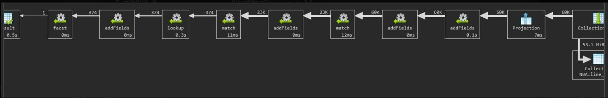

# Upit 3 - Koliko puta je svaka ekipa ispustila vodjstvo nakon 3/4 od 10 razlike, I u duelu izmedju koje dve fransize je doslo do najvise preokreta

## Proces optimizacije 

Sa obzirom na to da je vecina vremena u upitu potrosena na lookup, uveden je index na polje game_id.  

## Izvršavanje upita

```
db = db.getSiblingDB("csv");
db.getCollection("line_score").aggregate(
    [
        {
            "$addFields" : {
                "pts_qtr1_home" : {
                    "$toDouble" : "$pts_qtr1_home"
                },
                "pts_qtr2_home" : {
                    "$toDouble" : "$pts_qtr2_home"
                },
                "pts_qtr3_home" : {
                    "$toDouble" : "$pts_qtr3_home"
                },
                "pts_qtr1_away" : {
                    "$toDouble" : "$pts_qtr1_away"
                },
                "pts_qtr2_away" : {
                    "$toDouble" : "$pts_qtr2_away"
                },
                "pts_qtr3_away" : {
                    "$toDouble" : "$pts_qtr3_away"
                },
                "pts_home" : {
                    "$toDouble" : "$pts_home"
                },
                "pts_away" : {
                    "$toDouble" : "$pts_away"
                }
            }
        }, 
        {
            "$addFields" : {
                "f3q_home" : {
                    "$sum" : [
                        "$pts_qtr1_home",
                        "$pts_qtr2_home",
                        "$pts_qtr3_home"
                    ]
                },
                "f3q_away" : {
                    "$sum" : [
                        "$pts_qtr1_away",
                        "$pts_qtr2_away",
                        "$pts_qtr3_away"
                    ]
                }
            }
        }, 
        {
            "$match" : {
                "$or" : [
                    {
                        "$expr" : {
                            "$gt" : [
                                "$f3q_home",
                                {
                                    "$add" : [
                                        "$f3q_away",
                                        NumberInt(10)
                                    ]
                                }
                            ]
                        }
                    },
                    {
                        "$expr" : {
                            "$gt" : [
                                "$f3q_away",
                                {
                                    "$add" : [
                                        "$f3q_home",
                                        NumberInt(10)
                                    ]
                                }
                            ]
                        }
                    }
                ]
            }
        }, 
        {
            "$addFields" : {
                "bottler" : {
                    "$cond" : {
                        "if" : {
                            "$and" : [
                                {
                                    "$gt" : [
                                        "$f3q_home",
                                        {
                                            "$add" : [
                                                "$f3q_away",
                                                NumberInt(10)
                                            ]
                                        }
                                    ]
                                },
                                {
                                    "$gt" : [
                                        "$pts_away",
                                        "pts_home"
                                    ]
                                }
                            ]
                        },
                        "then" : {
                            "$concat" : [
                                "$team_city_name_home",
                                " ",
                                "$team_nickname_home"
                            ]
                        },
                        "else" : {
                            "$cond" : {
                                "if" : {
                                    "$and" : [
                                        {
                                            "$gt" : [
                                                "$f3q_away",
                                                {
                                                    "$add" : [
                                                        "$f3q_home",
                                                        NumberInt(10)
                                                    ]
                                                }
                                            ]
                                        },
                                        {
                                            "$gt" : [
                                                "$pts_home",
                                                "$pts_away"
                                            ]
                                        }
                                    ]
                                },
                                "then" : {
                                    "$concat" : [
                                        "$team_city_name_away",
                                        " ",
                                        "$team_nickname_away"
                                    ]
                                },
                                "else" : "NO"
                            }
                        }
                    }
                }
            }
        }, 
        {
            "$lookup" : {
                "from" : "game",
                "localField" : "game_id",
                "foreignField" : "game_id",
                "as" : "c2_data"
            }
        }, 
        {
            "$addFields" : {
                "home" : {
                    "$arrayElemAt" : [
                        "$c2_data.team_name_home",
                        NumberInt(0)
                    ]
                },
                "away" : {
                    "$arrayElemAt" : [
                        "$c2_data.team_name_away",
                        NumberInt(0)
                    ]
                }
            }
        }, 
        {
            "$match" : {
                "bottler" : {
                    "$ne" : "NO"
                }
            }
        }, 
        {
            "$facet" : {
                "Bottling_count" : [
                    {
                        "$group" : {
                            "_id" : "$bottler",
                            "count" : {
                                "$sum" : NumberInt(1)
                            }
                        }
                    }
                ],
                "Most_intense_matchup " : [
                    {
                        "$group" : {
                            "_id" : {
                                "p1" : "$home",
                                "p2" : "$away"
                            },
                            "count" : {
                                "$sum" : NumberInt(1)
                            }
                        }
                    },
                    {
                        "$sort" : {
                            "count" : NumberInt(-1)
                        }
                    },
                    {
                        "$limit" : NumberInt(1)
                    }
                ]
            }
        }
    ], 
    {
        "allowDiskUse" : false
    }
);
```

## Statistika upita 


## Zaključak 

**Ukupno vreme trajanja upita:** 0.5 sekundi

**Broj ulaznih dokumenata:** 60 hiljada


