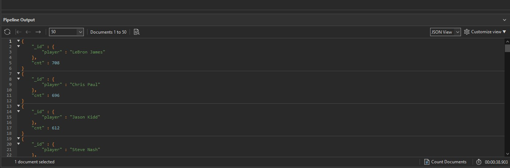

# Upit 5 - Igraci sa najvise double-double ucinaka

## Optimizacija upita 
Najveći problem kod analiziranja podataka play-by-play je taj što podaci o asistencijama i poenima nisu ni u prvoj normalnoj formi, odnosno ne postoji polje koje reprezentuje podatke o postignutom poenu, 
asistenciji, skoku...
Moguće rešenje za optimizaciju upita vezanih za pojedinačne statistike igrača je da se napravi potpuno nova kolekcija _box_score_ koja bi predstavljala učinak igrača po utakmici.
Ipak, zbog nepostojanja odgovarajućih polja, proces restruktuiranja sheme kako bi se kreirala takva kolekcija je previše kompleksan i posle nekoliko pokušaja pokretanja upita, koji su predugo trajali, odustalo se od te ideje. 
Uvođenjem indeksa na polje _eventmsgtype_ pretraživanje kolekcije play_by_play se znatno ubrzalo, ali ipak zbog kompleksnosti upita i potrebe za paralelnom obradom iste kolekcije dva puta naredbom $facet, postignuto je ubrzanje na 38 sekundi. Sve preko toga bi zahtevalo kreiranje posebne kolekcije. 

## Izvršavanje upita

```
db.getCollection("play_by_play").aggregate(
    [
        {
            "$facet" : {
                "assists" : [
                    {
                        "$match" : {
                            "eventmsgtype" : NumberInt(1)
                        }
                    },
                    {
                        "$match" : {
                            "$or" : [
                                {
                                    "homedescription" : /10 AST/i
                                },
                                {
                                    "awaydescription" : /10 AST/i
                                }
                            ]
                        }
                    },
                    {
                        "$group" : {
                            "_id" : {
                                "game_id" : "$game_id",
                                "player" : "$player2_name"
                            }
                        }
                    }
                ],
                "points" : [
                    {
                        "$match" : {
                            "eventmsgtype" : NumberInt(1)
                        }
                    },
                    {
                        "$match" : {
                            "$or" : [
                                {
                                    "homedescription" : /(10 PTS)|(11 PTS)|(12 PTS)/i
                                },
                                {
                                    "awaydescription" : /(10 PTS)|(11 PTS)|(12 PTS)/i
                                }
                            ]
                        }
                    },
                    {
                        "$group" : {
                            "_id" : {
                                "game_id" : "$game_id",
                                "player" : "$player1_name"
                            }
                        }
                    }
                ]
            }
        }, 
        {
            "$project" : {
                "newRoot" : {
                    "$concatArrays" : [
                        "$assists",
                        "$points"
                    ]
                }
            }
        }, 
        {
            "$unwind" : {
                "path" : "$newRoot"
            }
        }, 
        {
            "$group" : {
                "_id" : {
                    "player" : "$newRoot._id.player",
                    "game" : "$newRoot_id.game_id"
                },
                "cnt" : {
                    "$sum" : NumberInt(1)
                }
            }
        }, 
        {
            "$sort" : {
                "cnt" : NumberInt(-1)
            }
        }
    ], 
    {
        "allowDiskUse" : false
    }
);
```

## Statistika upita 


## Zaključak 

**Ukupno vreme trajanja upita:** 37 sekundi

**Broj ulaznih dokumenata:** 13 miliona


