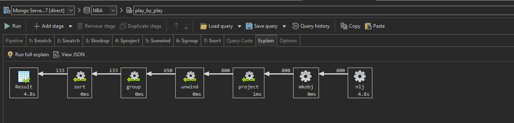

# Upit 3 - Odrediti top 10 igrača po broju utakmica na kojima su postigli 40 ili više poena, kao i spisak tih utakmica

## Proces optimizacije 

S obzirom da se u početnoj fazi upita vrši provera da li eventmsgtype iznosi 1 ili 3, dodat je index na kolonu eventmsgtype čime je upit ubrzan na 4.8 sekundi 

## Izvršavanje upita 
```
  db.getCollection("play_by_play").aggregate(
    [
        {
            "$match" : {
                "$or" : [
                    {
                        "eventmsgtype" : {
                            "$eq" : NumberInt(1)
                        }
                    },
                    {
                        "eventmsgtype" : {
                            "$eq" : NumberInt(3)
                        }
                    }
                ]
            }
        },
        {
            "$match" : {
                "$or" : [
                    {
                        "homedescription" : /(40 PTS)|(41 PTS)|(42 PTS)/i
                    },
                    {
                        "awaydescription" : /(40 PTS)|(41 PTS)|(42 PTS)/i
                    }
                ]
            }
        }, 
        {
            "$lookup" : {
                "from" : "game",
                "localField" : "game_id",
                "foreignField" : "game_id",
                "as" : "game_info"
            }
        }, 
        {
            "$project" : {
                "player1_name" : NumberInt(1),
                "homedescription" : NumberInt(1),
                "awaydescription" : NumberInt(1),
                "game_info" : {
                    "game_date" : NumberInt(1),
                    "team_name_home" : NumberInt(1),
                    "pts_home" : NumberInt(1),
                    "team_name_away" : NumberInt(1),
                    "pts_away" : NumberInt(1)
                }
            }
        }, 
        {
            "$unwind" : {
                "path" : "$game_info"
            }
        }, 
        {
            "$group" : {
                "_id" : "$player1_name",
                "count" : {
                    "$sum" : NumberInt(1)
                },
                "games" : {
                    "$push" : "$game_info"
                }
            }
        }, 
        {
            "$sort" : {
                "count" : NumberInt(-1)
            }
        }
    ], 
    {
        "allowDiskUse" : true
    }
);
```
## Statistika upita 
  


  
## Zaključak 

**Ukupno vreme trajanja upita:** 4.8 sekundi 

**Broj ulaznih dokumenata:** 13 miliona

